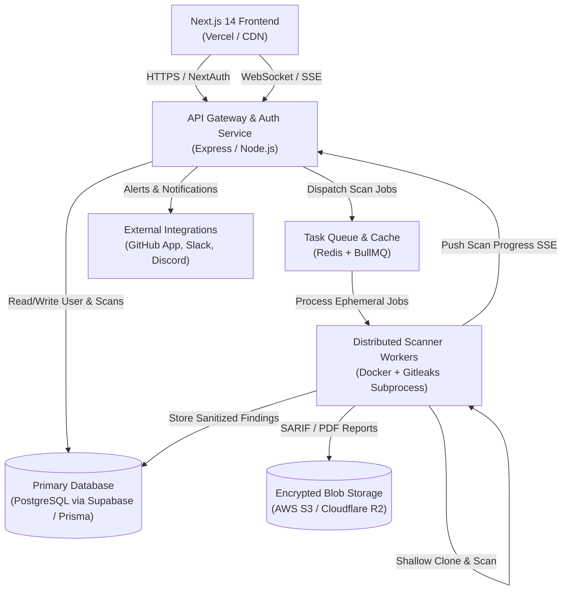

# 🚀 Secretless Code — Production-Grade SaaS Upgrade Roadmap

> **Target**: Scale Secretless Code from an ephemeral prototype into an enterprise-ready, multi-tenant Credential Security & SAST Platform.  
> **Team Size**: 5 Engineers  
> **Target Release**: Production v2.0  

---

## 🏛️ System Architecture (Production v2.0)



---

## 👥 5-Member Team Division & Ownership

```
┌────────────────────────────────────────────────────────────────────────┐
│                          TEAM WORKSTREAM DIVISION                      │
├───────────────────┬────────────────────────────────────────────────────┤
│ Member 1          │ Frontend Lead: 3D Visuals, Landing Page, 404 & UI  │
│ Member 2          │ Frontend App: Auth, Dashboard, Reports & UX        │
│ Member 3          │ Backend Lead: Database Architecture & Core APIs    │
│ Member 4          │ Scanning Engine: Redis Queue, WebSockets & Workers │
│ Member 5          │ DevOps, GitHub App Integrations & Security Hardening│
└───────────────────┴────────────────────────────────────────────────────┘
```

---

### 🎨 Member 1: Frontend Creative Lead (3D Visuals, Landing Funnel & UI)
**Objective**: Build a high-converting, visually breathtaking marketing and onboarding experience with interactive 3D assets, smooth micro-animations, and complete error handling.

- [ ] **Interactive 3D Hero Element**:
  - Implement a 3D Cyber Shield / Wireframe Globe using `@react-three/fiber` + `@react-three/drei` (or an optimized Spline embed) that reacts to mouse movement.
  - Add ambient particle background with glowing grid matrix lines.
- [ ] **High-Converting Landing Page Sections**:
  - **Hero Section**: Dynamic typing effect, instant URL scanner input, 3D interactive model.
  - **Feature Showcase**: Interactive comparison grid (Secretless Code vs. Manual Code Review).
  - **Supported Leaks Grid**: Interactive icons for AWS, GitHub PATs, Stripe, OpenAI, MongoDB, SSH keys, etc.
  - **Interactive CTA Banner**: "Protect your organization against repo leaks in 30 seconds."
  - **Pricing Tier Cards**: Free ($0/mo), Pro ($29/mo), Team/Enterprise ($99+/mo) with toggleable annual discount.
- [ ] **Custom 404 & Error Pages (`not-found.tsx` & `error.tsx`)**:
  - Interactive terminal-themed 404 page ("404: Secret Not Found") with a "Scan Another Target" radar button.
  - Smooth fallback animations using `framer-motion`.
- [ ] **Design System Polish**:
  - Unify styling tokens (Tailwind CSS colors, glassmorphic card primitives, glowing borders, custom cyber badges).
  - Dark/Light mode toggle support (defaulting to cyber-slate dark).

---

### 💻 Member 2: Frontend App Architect (Auth, Dashboard & Reports)
**Objective**: Build the authenticated user portal where developers and security teams manage scan histories, configure alert thresholds, and export compliance reports.

- [ ] **Authentication & User Management Integration**:
  - Integrate **NextAuth.js** (or **Supabase Auth** / **Clerk**) with GitHub OAuth and Google Sign-In.
  - Persistent user session handling and avatar profile menu.
  - Public scan mode vs. Authenticated scan mode (authenticated users unlock unlimited scan history and PDF export).
- [ ] **Enterprise Dashboard (`/dashboard`)**:
  - **Recent Scans Grid**: Search, sort, and filter previous scans by date, repository, and severity.
  - **Vulnerability Trends Chart**: Line/bar charts showing detected secrets over time using `Recharts` or `Chart.js`.
  - **Vulnerability Status Tracking**: Allow users to mark findings as `Resolved`, `False Positive`, or `Under Investigation`.
- [ ] **Compliance & Report Exporter**:
  - **PDF Executive Summary**: One-click branded PDF export using `@react-pdf/renderer` or `jspdf`.
  - **SARIF Standard Export**: Download scan results formatted in SARIF (Static Analysis Results Interchange Format) for importing into GitHub Security Center or SonarQube.
- [ ] **Remediation Guide Drawer**:
  - Sliding slide-over drawer when a user clicks a finding showing exact remediation steps (e.g. *How to revoke AWS Access Keys* or *How to rewrite git commit history using git-filter-repo*).

---

### 🗄️ Member 3: Backend & Database Architect (Data Layer & Core APIs)
**Objective**: Transition the backend from stateless in-memory processing to a structured relational database architecture with clean multi-tenancy, audit trails, and robust API validation.

- [ ] **Database Setup & ORM (PostgreSQL + Prisma / Supabase)**:
  - Configure PostgreSQL database with connection pooling (`PgBouncer`).
  - Set up **Prisma ORM** with automated migrations.
- [ ] **Database Schema Design**:
  ```prisma
  model User {
    id            String         @id @default(cuid())
    email         String         @unique
    name          String?
    avatarUrl     String?
    role          Role           @default(DEVELOPER)
    createdAt     DateTime       @default(now())
    organizations Organization[]
    scans         Scan[]
    apiKeys       ApiKey[]
  }

  model Scan {
    id             String        @id @default(cuid())
    userId         String?
    user           User?         @relation(fields: [userId], references: [id])
    repoUrl        String
    repoOwner      String
    repoName       String
    branch         String        @default("main")
    status         ScanStatus    @default(PENDING) // PENDING, RUNNING, COMPLETED, FAILED
    scanDurationMs Int?
    repoSizeMB     Float?
    findingsCount  Int           @default(0)
    findings       Finding[]
    createdAt      DateTime      @default(now())
  }

  model Finding {
    id           String          @id @default(cuid())
    scanId       String
    scan         Scan            @relation(fields: [scanId], references: [id], onDelete: Cascade)
    ruleId       String
    secretType   String
    severity     Severity        // CRITICAL, HIGH, MEDIUM, LOW
    filePath     String
    lineNumber   Int
    maskedSecret String
    status       FindingStatus   @default(OPEN) // OPEN, RESOLVED, FALSE_POSITIVE
    createdAt    DateTime        @default(now())
  }

  enum Role { DEVELOPER ADMIN SECURITY_LEAD }
  enum ScanStatus { PENDING RUNNING COMPLETED FAILED }
  enum Severity { CRITICAL HIGH MEDIUM LOW }
  enum FindingStatus { OPEN RESOLVED FALSE_POSITIVE }
  ```
- [ ] **RESTful API Refactoring & Zod Validation**:
  - Refactor backend into a modular layer: `routes/`, `controllers/`, `services/`, `middlewares/`.
  - Validate all incoming payloads with strict **Zod** schemas.
- [ ] **API Keys & Public API**:
  - Allow users to generate API tokens (`sec_live_...`) to trigger scans programmatically from custom CI scripts.
  - Implement `/api/v1/scans` (POST, GET, list with pagination).

---

### ⚡ Member 4: Engine & Asynchronous Queue Lead (Redis, Workers & Real-Time)
**Objective**: Decouple scan executions from HTTP request lifecycles using Redis and BullMQ, and provide live real-time log streaming to the frontend.

- [ ] **Asynchronous Scan Pipeline with Redis + BullMQ**:
  - Replace synchronous route execution with job dispatch: `POST /api/scan` queues a job and returns `{ jobId, status: "queued" }`.
  - Scalable worker processes that pick jobs from the Redis queue.
  - Concurrency control: limit to `N` simultaneous git clones to protect worker memory and disk I/O.
- [ ] **Real-Time Progress Streaming (WebSockets / Server-Sent Events)**:
  - Implement SSE (`GET /api/scans/:id/stream`) or `Socket.io` channel.
  - Push live granular progress events to frontend:
    1. `CLONING_REPO` (with cloned bytes progress)
    2. `RUNNING_GITLEAKS`
    3. `EVALUATING_RULES`
    4. `PURGING_TEMP_DIRECTORY`
    5. `SCAN_COMPLETED`
- [ ] **Advanced Gitleaks Capabilities**:
  - **Historical Git Scan Mode**: Optional full commit log scanning (`--depth=full` or past `N` commits) vs shallow quick scan (`--depth=1`).
  - **Custom Ruleset Upload**: Support custom company secret patterns via a `.gitleaks.toml` configuration parser.
  - **Multi-Branch Selection**: Allow users to specify target branch (`main`, `develop`, etc.) or scan tags.
- [ ] **Automated Temp Directory Garbage Collector**:
  - A background cron worker that cleans orphaned temporary directories in `/tmp` older than 10 minutes to guarantee zero disk leaks even in edge-case server crashes.

---

### 🛡️ Member 5: DevOps, Integrations & Security Lead (GitHub App & CI/CD)
**Objective**: Build automation integrations (GitHub App, Slack alerts), rate limiting, containerization, and production CI/CD deployments.

- [ ] **GitHub App & PR Automated Scanning**:
  - Create a **GitHub App** integration ("Secretless Code Bot").
  - On `pull_request` webhook: automatically scan incoming PR diffs for leaked secrets.
  - Post automated inline comments on the PR with red warning banners if a secret is committed, blocking the merge.
- [ ] **Webhook & Chat Notifications**:
  - **Slack / Discord Integration**: Send rich formatted embeds when a scan completes or a Critical secret is detected.
  - User-configurable outgoing webhooks (`POST` payload on scan completion).
- [ ] **Rate Limiting & Abuse Prevention**:
  - Integrate `express-rate-limit` backed by Redis (`ioredis`).
  - IP-based rate limiting for anonymous scans (e.g. 5 scans/hour).
  - Authenticated tier rate limiting (e.g. 100 scans/day for Pro users).
- [ ] **Containerization & CI/CD Automation**:
  - Multi-container `docker-compose.yml` for local staging (Frontend + Backend + PostgreSQL + Redis).
  - **GitHub Actions Pipeline**:
    - Automated linting & type checks (`tsc --noEmit`).
    - Unit tests for validator and mask utility (`jest` or `vitest`).
    - Docker container builds and automated push to registry.
  - Production deployments: Backend on **Render / Railway / AWS ECS**, Frontend on **Vercel**, DB on **Supabase / AWS RDS**.

---

## 📅 Sprint Execution Timeline (4-Week Plan)

| Sprint / Week | Member 1 (Creative UI) | Member 2 (App & Auth) | Member 3 (DB & Core) | Member 4 (Queue & SSE) | Member 5 (DevOps & Git) |
|---|---|---|---|---|---|
| **Week 1: Foundations** | 3D Hero Wireframe & Visual Tokens | NextAuth & GitHub OAuth setup | PostgreSQL + Prisma schema setup | Redis + BullMQ worker scaffolding | Docker Compose & Rate Limiting |
| **Week 2: Core Work** | Landing Page Sections & CTA cards | Dashboard layout & Scan History table | Scans & Findings CRUD APIs | SSE / WebSocket live stream pipe | Slack/Discord Webhook service |
| **Week 3: Advanced** | 404 Page, Pricing & Animations | Remediation Drawer & PDF export | API Key generation & Zod schemas | Full commit scan mode & auto-cleanup | GitHub App PR scanner bot |
| **Week 4: Launch** | Responsive polish & SEO meta tags | User settings & org management | DB indexing & query optimization | Stress testing queue with 50 concurrent scans | Production deployment & DNS |

---

## 🛠️ Recommended Tech Stack Summary

| Layer | Recommended Production Choice | Alternatives |
|---|---|---|
| **Frontend Framework** | **Next.js 14 (App Router)** | Vite + React SPA |
| **3D & Animations** | **Three.js + React Three Fiber / Framer Motion** | Spline |
| **Styling** | **Tailwind CSS + Lucide Icons** | Shadcn UI |
| **Authentication** | **NextAuth.js / Supabase Auth** | Clerk |
| **Backend API** | **Node.js + Express (Modular TypeScript)** | NestJS / Fastify |
| **Database** | **PostgreSQL (Supabase or Neon) with Prisma ORM** | MongoDB with Mongoose |
| **Task Queue & Cache** | **Redis (Upstash / Redis Cloud) + BullMQ** | RabbitMQ / Celery |
| **Scanning Engine** | **Gitleaks CLI v8 Subprocess (Isolated Container)** | TruffleHog |
| **Storage (Reports)** | **Cloudflare R2 / AWS S3** | Supabase Storage |
| **Hosting (Frontend)** | **Vercel** | Cloudflare Pages |
| **Hosting (Backend/Queue)** | **Render / Railway / AWS ECS (Docker)** | Fly.io |
